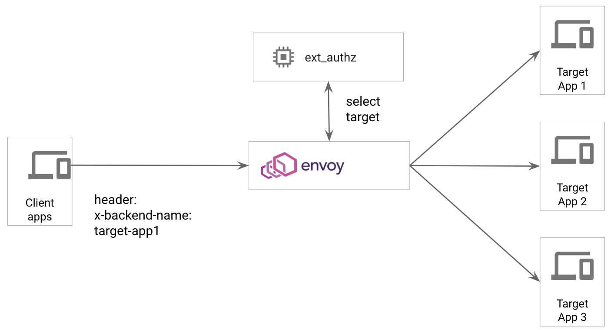

# envoy-extensions

This repo demostrates two patterns to extend Envoy to add custom logic before sending the request to the actual upstream application.

## Patterns

### Pattern 1 - External Authorization (ext_authz filter)

This pattern leverages the ext_authz filter in Envoy to callout to an external service.

The external service can:

1. Implement custom rules for authorization

2. Implement routing changes

3. Access the payload (but not modify it) - upto a limit specified in the Envoy configuration

See more [here](./pattern1)

### Pattern 2 - Envoy chaining (aka Envoy "sandwich")

This pattern leverages two logical Envoy proxies sandwiched between custom code/logic.

The middle proxy can:

1. Implment routing changes.

2. Full access to the payload to transform/modify.

See more [here](./pattern2)

___

## Support

This is not an officially supported Google product
