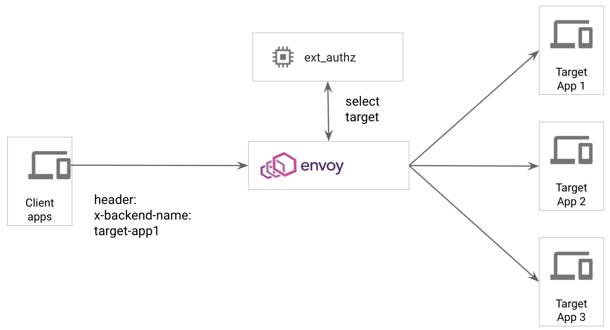

# Pattern 1 - External Authorization

This sample implements Envoy's [external authorization](https://www.envoyproxy.io/docs/envoy/latest/api-v2/config/filter/http/ext_authz/v2/ext_authz.proto) filter to demonstrate simple routing of requests to upstream targets

## Scenario

In this example, a client sends requests to an endpoints serviced by Envoy. The consumer passes a header (`x-backend-name`) with the name the name of the backend. Envoy calls the ext_authz service and dynamically routes the consumer to the appropriate backend.



## Configuration

Routing configuration is managed by `routes.json` file. The file has three parts to it:

* `allowList`: The paths allowed for access by the consumer. The other paths are rejected by the ext_authz service. There is a flag to enable/disable this.
* `routeHeader`: The name of the header the consumer uses to select a route. The default header is `x-backend-name`. One can easily modify this to look for a claim in the JWT token.
* `routerules`: A list of rules that map a name to basePath and hostname. This routes are not directly accessible by the consumer.

## Testing via docker

Step 1: Build the docker image

```bash
./build-docker.sh
```

## Testing locally

These steps work on Linux/Debian machines

Step 1: Run ext-authz server

```bash
go run ./server/main.go
```

Step 2: Run envoy

```bash
envoy -c envoy.yaml
```

## Test endpoint(s)

Pass no backend header. The default will send the request to [https://httpbin.org](https://httpbin.org)

```bash
curl localhost:8080/route -v

{
  "args": {},
  "headers": {
    "Accept": "*/*",
    "Content-Length": "0",
    "Host": "localhost",
    "User-Agent": "curl/7.72.0",
    "X-Amzn-Trace-Id": "Root=1-5f66d5bd-b781a4b0bc327988a65b5308",
    "X-Backend-Url": "default",
    "X-Envoy-Expected-Rq-Timeout-Ms": "15000",
    "X-Envoy-Original-Path": "/httpbin/get"
  },
  "origin": "xxxxx",
  "url": "https://localhost/get"
}
```

Pass mocktarget header to send to [https://mocktarget.apigee.net](https://mocktarget.apigee.net)

```bash
curl localhost:8080/route -v -H "x-backend-name: mocktarget"

<H2>I <3 APIs</H2>
```

Pass postman header to send to [https://postman-echo.com](https://postman-echo.com)

```bash
curl localhost:8080/route -v -H "x-backend-name: postman"

{"args":{},"headers":{"x-forwarded-proto":"https","x-forwarded-port":"443","host":"postman-echo.com","x-amzn-trace-id":"Root=1-5f66d571-fa7aef58f8499f30a449a694","content-length":"0","user-agent":"curl/7.72.0","accept":"*/*","x-backend-url":"postman","x-request-id":"df845e9a-62ce-403c-ade4-1fcc9352a858","x-envoy-expected-rq-timeout-ms":"15000","x-envoy-original-path":"/postman"},"url":"https://postman-echo.com/get"}
```

### Cleanup

```bash
./clean-docker.sh
```

## Testing with Apigee

NOTE: This step assumes you have completed the prereqisuite steps for [Apigee Envoy adapter](https://cloud.google.com/apigee/docs/api-platform/envoy-adapter/v1.1.x/concepts)

Step 1: Set up prerequite files in the `apigee` folder. These files are gotten by settging up the Apigee Envoy adapter

```
apigee
├── config
│   ├── config.yaml
├── certs
│   ├── tls.key
│   ├── tls.crt
│   ├── ca.crt
├── policy-secret
│   ├── remote-service.key
│   ├── remote-service.crt
│   ├── remote-service.properties
```

Step 2: Build the docker image

```bash
./build-docker-apigee.sh
```

Step 3: Test the endpoints

Make sure you setup an API Product for `/route`, get credentials (developer app) and then try the endpoints.

### Cleanup

```bash
./clean-docker-apigee.sh
```
