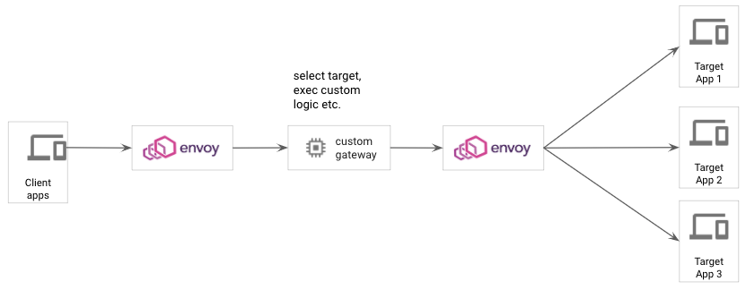

# Pattern 2 - Envoy chaining/Envoy "sandwich"

This sample implements Envoy's [external authorization](https://www.envoyproxy.io/docs/envoy/latest/api-v2/config/filter/http/ext_authz/v2/ext_authz.proto) filter to demonstrate simple routing of requests to upstream targets

## Scenario

In this example, a client sends requests to an endpoints serviced by Envoy. The consumer passes a header (`x-backend-name`) with the name the name of the backend. Envoy calls the ext_authz service and dynamically routes the consumer to the appropriate backend.



## Testing via docker

Step 1: Build the docker image

```bash
./build-docker.sh
```

## Test endpoint(s)

The request goes to Envoy on port 8080, which forwards the request to a Go application on port 7080. Custom processing can be performed here. The call is then forwarded to Envoy on port 9080 for final backend routing.

```bash
curl localhost:8080/httpbin -v

{
  "args": {},
  "headers": {
    "Accept": "*/*",
    "Content-Length": "0",
    "Host": "localhost",
    "User-Agent": "curl/7.72.0",
    "X-Amzn-Trace-Id": "Root=1-5f66d5bd-b781a4b0bc327988a65b5308",
    "X-Backend-Url": "default",
    "X-Envoy-Expected-Rq-Timeout-Ms": "15000",
    "X-Envoy-Original-Path": "/httpbin/get"
  },
  "origin": "xxxxx",
  "url": "https://localhost/get"
}
```

### Cleanup

```bash
./clean-docker.sh
```